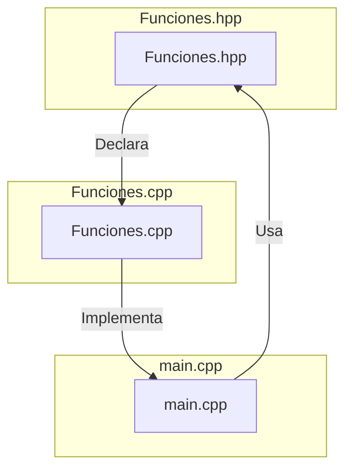

# Proyecto: Análisis de Funciones Cuadráticas y Aplicación Matemática

## Aspectos Formales

- **Nombres y Roles:**
  - **BASTIAN IGNACIO TORRES CAMPILLAY (202204637-6**): Diseño e implementación de menú interactivo, documentación y pruebas.

  - **RAFAEL EDUARDO ORTIZ CABALLERO (202304594-2)**: Implementación de cálculo de raices, discriminante y concavidad.

  - **AHMARU OSHIEN HUIDOBRO GARCIA (202330540-5)**: Implementación de calculo de vertices y eje de simetría  
  
  - **JOSE ANTONIO HORMAZABAL SAEZ (202310172-9)**: Implementación de intercepto del eje Y.

- **Título del Proyecto:**  
  _Análisis de Funciones Cuadráticas y Aplicación Matemática para Estudiantes de Educación Media._

- **Fecha:**  
  10 de Septiembre de 2024.

## Descripción del Proyecto

Este proyecto está diseñado para estudiantes de educación media y tiene como objetivo introducirlos a conceptos matemáticos clave a través de la función cuadrática. La idea es que los estudiantes puedan comprender de manera gráfica e interactiva las propiedades básicas de la función cuadrática, así como conceptos más avanzados como límites, derivadas e integrales.


### Avance del Proyecto

- **Hito 1: Análisis de las Propiedades de una Función Cuadrática**  
  En esta primera etapa, se ha implementado el análisis matemático de una función cuadrática, incluyendo:
  - Cálculo del vértice.
  - Cálculo de las raíces reales o complejas.
  - Determinación de la concavidad.
  - Cálculo del eje de simetría.
  - Intercepto en el eje Y.
  - Cálculo de la función en algún punto.

  Se ha desarrollado un menú interactivo que permite a los usuarios ingresar coeficientes de la función cuadrática y calcular sus propiedades.

- **Próximos Pasos (Hito 2):**  
  En el siguiente hito, se trabajará en el análisis de **límites**, **derivadas** e **integrales** de la función cuadrática.

## Diagrama de Componentes


## Requisitos del Sistema y Compilación

### Requisitos del Sistema

- **Sistema Operativo**:
  - **Windows** (con Cygwin o WSL para entornos de compilación con `make`)
  - **Linux** (nativo)
  - **macOS** (nativo)
  
- **Compilador (g++)**:
  - **C++11** o superior, como:
    - GCC (versión 4.8.1 o superior)
    - Clang (versión 3.3 o superior)
    - MinGW (para Windows)
  
- **Herramientas de Compilación**:
  - `make` (sistema de construcción)
  - Terminal o consola para ejecutar el programa.

### Instrucciones de Instalación y Compilación:

- **Clonar el repositorio desde GitLab** 
    ```
    git clone https://gitlab.com/cuadratic_boys/cuadraticas.git
    ```
    
- **Acceder al directorio del proyecto**
    ```
    cd src
    ```
- **Compilar el proyecto** 
    ```
    make
    ```
- **Ejecutar el proyecto** 
    ```
    make run
    ```

## Referencias 

- Wikipedia - Función cuadrática: `https://es.wikipedia.org/wiki/Funci%C3%B3n_cuadr%C3%A1tica`

- Symbolab - Calculadora matemática: `https://es.symbolab.com/`